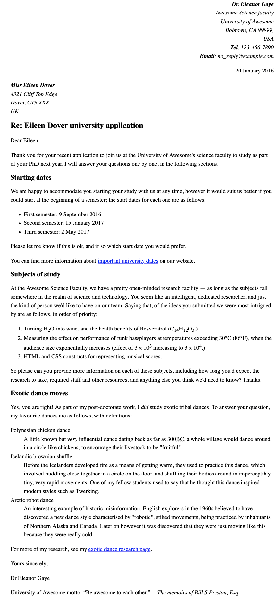

<!-- LTeX: language=fr -->

Exercice lettre HTML
====================

Consignes pour le rendu :

- Exercices individuels à rendre au plus tard le 20/02/2022 à 19h.
- Vos réponses sont à rendre en HTML uniquement.
- Le nom de fichier doit être de la forme `<Prénom>_<Nom>-lettre-4L4SC02P.html`, par exemple
  pour William Labov, le nom du fichier sera `William_Labov-lettre-4L4SC02P.html`.
  - Pour éviter les éventuels problèmes d'encodage ou de plateformes, merci d'utiliser une version
  de vos noms et prénoms en alphabet latin (toutes mes excuses)
- Dépôt sur [Cours en ligne](https://coursenligne.parisnanterre.fr/course/view.php?id=8022) (clé
  d'inscription `lovelace`)

Les consignes à suivre sont celle de
[MDN](https://developer.mozilla.org/fr/docs/Learn/HTML/Introduction_to_HTML/Marking_up_a_letter),
reproduite ici par praticité :

Tôt ou tard nous apprenons toustes à écrire une lettre ; c'est aussi un exemple utile pour tester
nos compétences en matière de mise en forme ! Dans cet exercice, vous devrez opérer le balisage
d'une lettre en utilisant les fonctionnalités textes élémentaires et avancées, y compris les
hyperliens, et en plus nous testerons vos connaissances avec certains contenus de `<head>` en HTML.

Avant de se lancer dans cet exercice, vous devez déjà avoir travaillé :

- [Commencer avec le
  HTML](https://developer.mozilla.org/fr/docs/Learn/HTML/Introduction_to_HTML/Getting_started),
- [Qu'y a-t-il dans l'en-tête ? Métadonnées en
  HTML](https://developer.mozilla.org/fr/docs/Learn/HTML/Introduction_to_HTML/The_head_metadata_in_HTML)
- [Fondamentaux du texte
  HTML](https://developer.mozilla.org/fr/docs/Learn/HTML/Introduction_to_HTML/HTML_text_fundamentals)
- [Création
  d'hyperliens](https://developer.mozilla.org/fr/docs/Learn/HTML/Introduction_to_HTML/Creating_hyperlinks)
- [Formatage avancé du
  texte](https://developer.mozilla.org/fr/docs/Learn/HTML/Introduction_to_HTML/Advanced_text_formatting)

## Point de départ

Pour commencer cet exercice, vous devez récupérer le [texte brut que vous allez
baliser](assets-exercice/letter-text.txt) et les CSS [à inclure](assets-exercice/css.txt)
dans l'HTML. Créez un nouveau fichier `.html` avec l'éditeur de texte dans lequel vous allez
travailler (ou bien utilisez un site comme [JSBin](http://jsbin.com/) ou
[Glitch](https://glitch.com) pour faire l'exercice.)

## Projet « lettre »

Pour ce projet, votre tâche consiste à baliser une lettre destinée à être hébergée dans l'intranet
d'une université. La lettre est une réponse d'une chercheuse en poste à une doctorante éventuelle à
propos de sa candidature pour travailler à l'université.

Sémantique de blocs/structures :

- Il convient que vous donniez à la totalité du document une structure appropriée comprenant le type
  de document et les éléments `html`, `head` et `body`.
- La lettre doit être marquée avec une structure de paragraphes et d'en-têtes, en prenant en
  considération les points suivants : un en-tête de haut niveau (la ligne « Re : ») et trois
  en-têtes de deuxième niveau.
- Les dates de début des semestres, les sujets d'étude et les danses exotiques seront balisées avec
  les types de listes appropriés.
- Mettez les deux adresses dans l'élément `address`. En plus, chaque ligne des adresses doit être
  mise sur une nouvelle ligne sans que ce soit un nouveau paragraphe.

Sémantique en ligne :

- Les noms de l'expéditeur et du destinataire (et « Tél » et « email ») doivent être marqués comme
  étant de grande importance.
- Les quatre dates du document doivent être indiquées dans des éléments appropriés contenant des
  dates lisibles par la machine.
- La première adresse et la première date de la lettre doivent recevoir une valeur d'attribut de
  classe « sender-column » ; le CSS que vous ajouterez plus tard les alignera à droite, comme c'est
  le cas dans une mise en page de lettre classique.
- Les cinq acronymes/abréviations dans le corps du texte de la lettre seront marqués pour permettre
  leur développement.
- Les six indices/exposants seront balisés de manière appropriée.
- Les symboles « degré », « plus grand que », « multiplier » seront marqués avec les références
  d'entités voulues.
- Essayez de marquer au moins deux mots importants en gras/italique.
- Deux emplacements nécessitent un hyperlien ; ajoutez les liens appropriés avec des intitulés. Pour
  l'emplacement sur lequel le lien pointe, utilisez simplement `http://example.com`.
- La citation et la devise de l'université doivent être marquées avec les éléments appropriés.

Dans l'en-tête du document :

- Le jeu de caractères sera précisé comme étant utf-8 avec la balise `meta` appropriée.
- L'auteur de la lettre sera indiqué dans une balise `meta` adéquate.
- Les CSS fournies seront incorporées avec le marquage approprié, c'est-à-dire dans une balise
  `<style>`.

## Conseils et astuces

- Utilisez le [validateur HTML W3C](https://validator.w3.org/) pour valider votre HTML.
- Il n'est pas nécessaire de connaître les CSS pour faire cet exercice ; vous avez juste besoin de
  le mettre dans un élément HTML.

## Exemple

La capture d'écran suivante montre ce à quoi la lettre devrait ressembler après le balisage.

