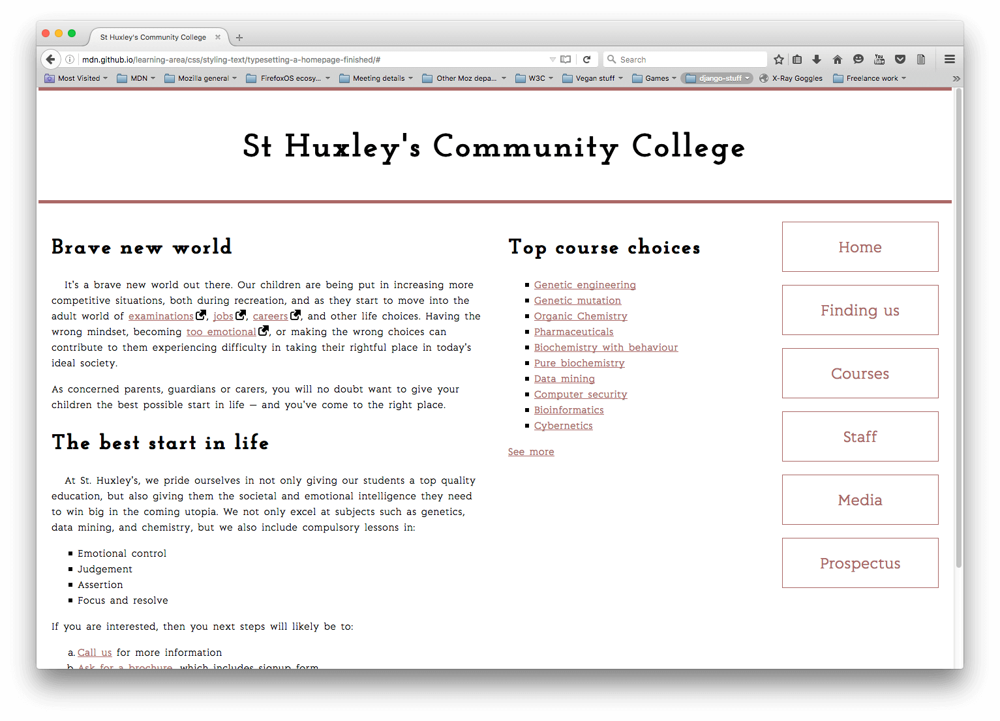

<!-- LTeX: language=fr -->

Exercice collège communautaire CSS
==================================

Consignes pour le rendu :

- Exercices individuels à rendre au plus tard le 06/03/2022 à 19h.
- Vos réponses sont à rendre en CSS uniquement.
- Le nom de fichier doit être de la forme `<Prénom>_<Nom>-college-4L4SC02P.css`, par exemple pour
  William Labov, le nom du fichier sera `William_Labov-college-4L4SC02P.css`.
  - Pour éviter les éventuels problèmes d'encodage ou de plateformes, merci d'utiliser une version
  de vos noms et prénoms en alphabet latin (toutes mes excuses)
- Dépôt sur [Cours en ligne](https://coursenligne.parisnanterre.fr/course/view.php?id=8022) (clé
  d'inscription `lovelace`)

Les consignes à suivre sont celle de
[MDN](https://developer.mozilla.org/fr/docs/Learn/CSS/Styling_text/Typesetting_a_homepage),
reproduite ici par praticité :

## Point de départ

Pour débuter cette évaluation, vous devez :

- Récupérer les fichiers [HTML](assets-exercice/index.html) et
  [CSS](https://github.com/mdn/learning-area/blob/master/css/styling-text/typesetting-a-homepage-start/style.css)
  de l'exercice ainsi que [l'icône « lien externe »](https://github.com/mdn/learning-area/blob/master/css/styling-text/typesetting-a-homepage-start/external-link-52.png).
- En faire une copie sur votre ordinateur.

**Note :** Autrement, il reste possible d'utiliser un site comme [CodePen](https://codepen.io/),
[jsFiddle](https://jsfiddle.net/), ou [Glitch](https://glitch.com/). Pour cela, copiez-coller
simplement le contenu des fichiers dans un de ces éditeurs et utilisez l'url
<http://mdn.github.io/learning-area/css/styling-text/typesetting-a-homepage-start/external-link-52.png>
pour pointer sur l'icône « lien externe ». Si l'éditeur en ligne que vous utilisez n'a pas de
panneau CSS séparé, vous pouvez l'intégrer dans un élément `<style>`, dans le `<head>` du
document (ou utiliser un meilleur éditeur).

## Énoncé de l'exercice

Nous mettons à votre disposition un document HTML pour la page d'accueil du site internet d'un
collège communautaire imaginaire, plus certains éléments du CSS, donnant le format en deux colonnes
de la page et fournissant d'autres rudiments de composition. Vous devez compléter le fichier CSS
sous le commentaire au bas du fichier de façon à pouvoir marquer aisément vos ajouts. Ne vous
tracassez pas si certains sélecteurs sont répétés : nous laisserons ce point de côté dans cet
exemple.

Polices de caractères :

- Primo, téléchargez quelques polices gratuites. Comme il s'agit d'un collège communautaire, les
  polices choisies doivent donner à la page une impression de sérieux, de formalisme et de confiance
  — une police serif ample pour le corps du texte général, associée une police sans serif ou bloc
  serif pour les en-têtes serait pas mal.
- Ensuite, utilisez le service ad-hoc pour créer le « bulletproof `@font-face` code » pour ces deux
  fontes.
- Appliquez la police pour le corps à toute la page et celle pour les titres aux en-têtes.

Style général du texte :

- Donnez à la page une propriété `font-size` de `10px` sur tout le site.
- Donnez aux titres et autres types d'éléments des tailles de polices appropriées définies avec une
  unité relative adéquate.
- Donnez au corps du texte une propriété `line-height` appropriée.
- Centrez le titre d'en-tête sue la page.
- Augmentez légèrement la valeur de la propriété `letter-spacing` des titres pour qu'ils ne
  paraissent pas trop écrasés en donnant un peu d'air aux lettres.
- Donnez au corps du texte une valeur de propriété `letter-spacing` et `word-spacing` appropriée.
- Donnez au premier paragraphe après chaque titre dans `<section>` une légère indentation, disons
  20 pixels.

Liens :

- Donnez aux liens, visités, ciblés et survolés des couleurs en accord avec celles des barres
  horizontales en haut et en bas de la page.
- Faites en sorte que les liens soient soulignés par défaut, mais que le soulignement disparaisse
  lorsqu'ils sont ciblés ou survolés.
- Supprimez le soulignement du focus par défaut de TOUS les liens de la page.
- Donnez à l'état actif un style sensiblement différent pour qu'il se démarque bien, mais faites en
  sorte qu'il s'intègre à la conception globale de la page.
- Faites en sorte que l'icône de lien externe soit insérée à côté des liens externes.

Listes :

- Assurez-vous que l'espacement des listes et éléments de liste s'accorde bien avec le style
  d'ensemble de la page. Chaque élément de liste doit avoir la même valeur de
  propriété `line-height` qu'une ligne de paragraphe et chaque liste doit avoir le même espacement
  en haut et en bas que celui entre les paragraphes.
- Mettez une belle puce, appropriée à la conception de la page, devant les éléments de la liste. À
  vous de décider si vous choisissez une image personnalisée ou autre chose.

Menu de navigation :

- Donnez à votre menu de navigation un style en accord avec l'apparence de la page.

## Conseils et astuces

- Il n'y a pas besoin de modifier le HTML en quoi que ce soit pour cet exercice.
- Le menu de navigation n'est pas forcément à représenter sous forme de boutons, mais pensez à lui
  donner une taille suffisant pour qu'il n'ait pas l'air ridicule.

## Exemple

La capture d'écran ci-après montre un exemple possible du design terminé :

