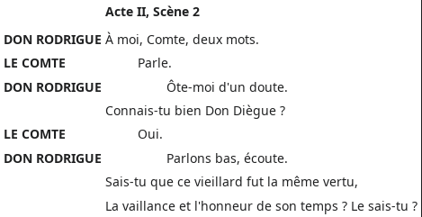
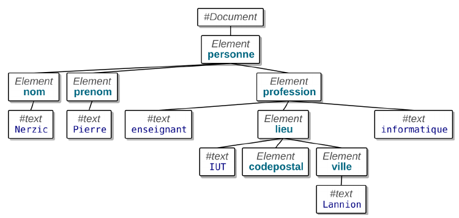
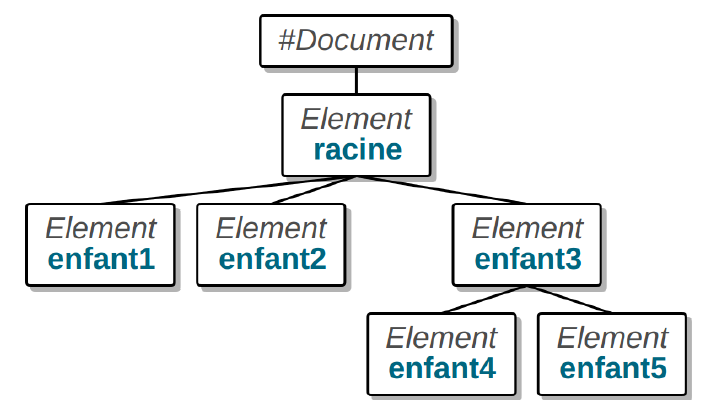

# Introduction

On a vu que HTML permettait de décrire des **documents** web

- Structurés
- Marqués sémantiquement
- Contenant des métadonnées

Dans un format **texte** : un document en HTML ce n'est qu'une très longue chaîne de caractères.

<small>Ce cours est inspiré entre autres des transparents [XML et données
internet](https://perso.univ-rennes1.fr/pierre.nerzic/XML) de Pierre Nerzic</small>

---

Pourquoi ce dernier point est intéressant :

- Facile à lire et modifier par des humains : c'est juste du texte.
  - Par opposition aux formats « binaires ».
- Facile à manipuler par un programme : traiter des chaînes de caractères, c'est de toute façon une
  tâche assez courante.

## Éléments sémantiques

On a vu qu'avec les éléments **sémantiques** de HTML, on pouvait marquer le sens d'élément
textuels :

```html
 <p><time datetime="2016-01-20">20 January 2016</time></p>

<address>
  <strong>Miss Eileen Dover</strong><br>
  4321 Cliff Top Edge<br>
  Dover, CT9 XXX<br>
  UK
</address>
```

---

Mais comment faire quand il n'y a pas d'élément sémantique qui correspond au besoin ? Par exemple
pour représenter l'extrait de script de théâtre suivant



---

On peut le faire en HTML comme ceci, pour un résultat qui ressemble à peu près

```html
<h1>Acte II, Scène 2</h1>
<p><b>DON RODRIGUE</b> À moi Comte, deux mots.</p>
<p><b>LE COMTE</b> Parle</p>
<p><b>DON RODRIGUE</b> Ôte-moi d'un doute. <br>
                       Connais-tu bien Don Diègue ?</p>
<p><b>LE COMTE</b> Oui.</p>
<p><b>DON RODRIGUE</b> Parlons bas, écoute.<br>
                       Sais-tu que ce vieillard fut la même vertu,<br>
                       La vaillance et l'honneur de son temps ? Le sais-tu ?</p>
```

Est-ce que vous voyez le problème ?

---

On a transcrit l'apparence du document, mais pas son sens :

- La mise en forme **esthétique** et non **sémantique**
- Or dans le document original, les éléments de mise en forme ont une qne
  - Numérotation de parties, insertion dans un ensemble
  - Indication de locuteur
  - Versification

On peut bricoler, par exemple avec des classes, pour retrouver la sémantique, comme `<b
class="speaker">` ou autres, mais c'est assez peu pratique.

---

Ce qui serait bien en fait, ça serait de pouvoir créer nos propres balises selon le document qu'on
veut représenter !

. . .

*Enter XML*

# XML

Le format XML est une réponse au problème ci-dessus : comment représenter des données structurées
**arbitraires** avec un langage balisé :

- Garder les avantages des formats textuels décrits plus haut.
- Ne pas être limité par un ensemble figé d'éléments et d'attributs comme ceux de HTML.

. . .

Historiquement, cette idée n'est pas venue après HTML, même si c'est une façon pratique d'y penser.
En réalité les deux format se sont essentiellement développés conjointement, avec des interactions
assez complexes.

## Exemples

Un itinéraire simple, du type « partir tout droit, au bout de 13 km, tournez à droite, au bout de
22 km, vous êtes arrivée. »

```xml
<?xml version="1.0" encoding="utf-8"?>
<!-- itinéraire fictif -->
<itineraire>
<etape distance="0km">départ</etape>
<etape distance="13km">tourner à droite</etape>
<etape distance="22km">arrivé</etape>
</itineraire>
```

---

Ingrédients pour [une recette](https://perleensucre.com/crepes-moelleuses-vegan)

```xml
<?xml version="1.0" encoding="utf-8"?>
<ingredients>
<i quantite="250 g">farine T45</i>
<i quantite="40 g">fécule de maïs</i>
<i quantite="30 g">sucre en poudre</i>
<i quantite="Une pincée">sel</i>
<i quantite="150 g">yaourt au soja nature</i>
<i quantite="650 ml">lait de soja nature</i>
<i quantite="40 ml">huile neutre</i>
</ingredients>
```

---

Une bibliographie (les espaces servent uniquement à faciliter la lecture)

```xml
<?xml version="1.0" encoding="UTF-8"?>
<bibliography>
<journalArticle>
  <title>The Misgendering Machines: Trans/HCI Implications of Automatic Gender Recognition</title><author><forename>Os</forename><surname>Keyes</surname></author>
  <journal>
    <title>Proceedings of the ACM on Human-Computer Interaction</title>
    <date>2018</date>
    <data type="url">https://doi.org/10.1145/3274357</data>
  </journal>
</journalArticle>
<book>
  <title>Introduction aux études sur le genre</title>
  <author><forename>Laure</forename><surname>Bereni</surname></author>
  <author><forename>Sébastien</forename><surname>Chauvin</surname></author>
  <author><forename>Anne</forename><surname>Ravillard</surname></author>
  <author><forename>Alexandre</forename><surname>Jaunait</surname></author>
  <publisher>De Boeck Université</publisher>
  <date>2012</date>
  <data type="url">https://halshs.archives-ouvertes.fr/halshs-01344006</data>
</book>
</bibliography>
```

---

Le Cid

```xml
<div type="act" n="II" xml:id="II"><head>Acte II</head>
  <div type="scene" n="2" xml:id="II2"><head>Scène 2</head>
    <sp><speaker>Rodrigue</speaker>
        <l part="I">À moi, comte, deux mots.</l></sp>
    <sp><speaker>Comte</speaker>
        <l part="M">Parle</l></sp>
    <sp><speaker>Rodrique</speaker>
        <l part="F">Ôte-moi d'un doute</l></sp>
    <sp><speaker>Comte</speaker>
        <l part="I">Connais-tu bien Don Diègue ?</l></sp>
    <sp><speaker>Comte</speaker>
        <l part="M">Oui</l></sp>
    <sp><speaker>Rodrigue</speaker>
      <l part="F">Parlons bas, écoute.</l>
      <l>Sais-tu que ce vieillard fut la même vertu,</l>
      <l>La vaillance et l'honneur de son temps ? Le sais-tu ?</l></sp>
  </div>
</div>
```

## Exploitation

Bien entendu, pour pouvoir exploiter ces informations facilement, il faut ensuite des programmes
capables de les lire !

. . .

Rendre les documents les plus homogènes possibles aide beaucoup, par exemple ceci n'est pas une
bonne idée :

```xml
<?xml version="1.0" encoding="utf-8"?>
<!-- itinéraire fictif -->
<itineraire>
<etape distance="0km">départ</etape>
<Etape><distance>13km</distance>tourner à droite</Etape>
<etape distance="22km"><infos>arrivée</infos></etape>
</itineraire>
```

---

Pour peu qu'on fasse attention, on peut utiliser XML pour décrire n'importe quel type de données
structurées. :

- Bureautique
  - LibreOffice : format OpenDocument
  - Publication de livres et documentations : DocBook
- Graphismes
  - Dessin vectoriel avec Inkscape : format SVG
  - Équations mathématiques : format MathML
- Itinéraires GPS : format GPX
- Base de données sémantiques : RDF
- Flux d'actualité : [RSS](rss.xml)

# Structure d'un document XML

Un document XML est composé de plusieurs parties :

- Entête de document précisant la version et l’encodage.
- Des règles optionnelles permettant de vérifier si le document est bien formé.
- Un arbre d'éléments basé sur un élément appelé racine

---

- Un élément possède un nom, des attributs et un contenu
- Le contenu d’un élément peut être :
  - Rien : élément vide noté `<nom />` ou `<nom attributs.../>`
  - Du texte
  - D'autres éléments (les éléments enfants).
- Un élément non vide est délimité par une balise ouvrante et une balise fermante.
  - Une balise ouvrante est notée `<nom attributs…>`
  - Une balise fermante est notée `</nom>`

---

Voici un document XML représentant une personne :

```xml
<?xml version="1.0" encoding="utf-8"?>
<personne>
<nom>Nerzic</nom>
<prenom>Pierre</prenom>
<profession>
enseignant
<lieu>
IUT
<codepostal/>
<ville>Lannion</ville>
</lieu>
informatique
</profession>
</personne>
```

---

Représentation graphique :




## Vocabulaire

Soit le document HTML suivant



---

Voici comment on désigne les différents nœuds les uns par rapport
aux autres :

- `<racine>` est le nœud parent du nœud enfant
- `<enfant3>`, lui-même parent de `<enfant4>` et `<enfant5>`,
- `<racine>`, `<enfant3>` sont des nœuds ancêtres de `<enfant4>` et `<enfant5>`,
- `<enfant4>` et `<enfant5>` sont des descendants de `<racine>` et `<enfant3>`,
- `<enfant1>` est un nœud frère de `<enfant2>` et réciproquement.

## Prologue

La première ligne d’un document XML est appelée **prologue**.

Elle spécifie la version de la norme XML utilisée (1.0 ou 1.1 qui sont très similaires) ainsi que
l’encodage :

```xml
<?xml version="1.0" encoding="utf-8"?>
```

## Commentaires

On peut placer des commentaires à peu près partout dans un document XML. La syntaxe est identique à
celle d’un fichier HTML. Un commentaire peut d’étendre sur plusieurs lignes. La seule contrainte est
de ne pas pouvoir employer les caractères `--` dans le commentaire, même s’ils ne sont pas suivis de
`>`

```xml
<!-- voici un commentaire -->
ceci n'est pas un commentaire
<!--
voici un autre commentaire
et ça -- , c'est une erreur
-->
```

## Directives

Après le prologue, on peut trouver plusieurs parties optionnelles
délimitées par `<?...?>` ou `<!...>`. Ce sont des instructions de
traitement, des directives pour l’analyseur XML.

Par exemple :

- Une *Document Type Definitions* (DTD) qui permet de valider le contenu du document. C’est l’objet
  du prochain cours.
- Une feuille de style.

```xml
<?xml version="1.0" encoding="utf-8"?>
<!DOCTYPE personne SYSTEM "personne.dtd">
<?xml-stylesheet href="personne.css" type="text/css"?>
```

# Éléments XML

Les éléments définissent la structure du document. Un élément est
délimité par :

- Une balise ouvrante `<nom attributs…>`
- Une balise fermante `</nom>` obligatoire.

Le contenu de l’élément se trouve entre les deux balises. Ce sont
des éléments enfants ou du texte.

```xml
<parent>
texte1
<enfant>texte2</enfant>
texte3
</parent>
```

---

Dans le cas où l’élément n’a pas de contenu (élément vide), on peut
regrouper ses deux balises en une seule `<nom attributs…/>`.

## Choses interdites

Les règles d’imbrication XML interdisent différentes configurations
qui sont plus ou moins tolérées en HTML :

- Plusieurs racines dans le document,
- Des éléments non terminés (XML est sensible à la casse),
- Des éléments qui se chevauchent.

```xml
<element1>
<element2>
</Element2>
<element3>
</element1>
</element3>
```

En XML, cela crée des erreurs « document mal formé ».

## Choses permises

Parmi les choses permises, le même type d’élément peut se trouver
plusieurs fois avec le même parent, avec des contenus identiques ou
différents :

```xml
<element1>
<element2>texte1</element2>
<element2>texte2</element2>
<element2>texte1</element2>
</element1>
```

## Noms des éléments

Les noms des éléments peuvent employer de nombreux caractères Unicode (correspondant au codage
déclaré dans le prologue) mais pas les signes de ponctuation.

L’initiale doit être une lettre ou le signe `_` ensuite, on peut trouver des lettres, des chiffres
ou `-`, `.`, et `_`.

**Exercice** : écrire une expression régulière pour valides les noms autorisés.

## Attributs

Les attributs caractérisent un élément. Ce sont des couples
`nom="valeur"` ou `nom='valeur'`. Ils sont placés dans la balise
ouvrante.

```xml
<?xml version="1.0" encoding="utf-8"?>
<meuble id="765" type='table'>
<prix monnaie='€'>74,99</prix>
<dimensions unites="cm" longueur="120" largeur="80"/>
<description langue='fr'>Belle petite table</description>
</meuble>
```

- Il n’y a pas d’ordre entre les attributs d’un élément,
- Un attribut ne peut être présent qu'une seule fois.

## Entités

Certains caractères sont interdits dans le contenu des éléments.
Comme il est interdit de les employer, XML propose une
représentation appelée référence d’entité ou entité pour simplifier.
On retrouve le même concept en HTML.

| Caractère |  Entité  |
| :-------: | :------: |
|    `<`    |  `&lt;`  |
|    `>`    |  `&gt;`  |
|    `&`    | `&amp;`  |
|    `’`    | `&apos;` |
|    `"`    | `&quot;` |

---

Voici un exemple d’emploi d’entités :

```xml
<?xml version="1.0" encoding="utf-8"?>
<achat-si type-groupement="&amp;&amp;">
<test>prix &lt; 50.00</test>
<test>description &lt;&gt; <str value="&quot;&quot;"/></test>
</achat-si>
```

- Cela entraîne une erreur si on remplace ces entités par le caractère correspondant,
- Ces entités sont automatiquement remplacées par les caractères lorsqu’on traite le fichier.
- Ce contenu bizarre vise uniquement à illustrer l’emploi d’entités.

## CDATA

Lorsqu’on veut écrire du texte brut à ne pas analyser, on emploie une section CDATA :

```xml
<?xml version="1.0" encoding="utf-8"?>
<fichier>
<nom>exemple1.xml</nom>
<md5><![CDATA[19573b741c0c5c8190a83430967bfa58]]></md5>
</fichier>
```

La partie entre <![CDATA[ et ]]> est ignorée par les analyseurs XML, on peut mettre n’importe quoi
sauf ]]>. Ces données sont considérées comme du texte par les analyseurs.
